
 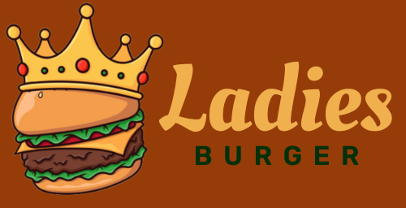 

 

# Resumo do projeto

O projeto Burger Ladies foi criado para um pequeno restaurante de hambúrgueres que está crescendo e necessita de uma interface em que se possa realizar pedidos utilizando um tablet, e enviá-los para a cozinha para que sejam preparados de forma ordenada e eficiente.

Este projeto tem duas áreas: a interface (cliente) e a API (servidor). A interface está sendo desenvolvida utilizando o framework React.

O cliente nos deu um [link](https://app.swaggerhub.com/apis-docs/ssinuco/BurgerQueenAPI/2.0.0) para a documentação que especifica o comportamento esperado da API HTTP que deve consumir. Aqui você pode encontrar todos os detalhes dos endpoints , como, por exemplo, quais parâmetros esperam, quais devem responder, etc.

---

 

### Logins e senhas:

~~~javascript 
  [ { "Adm": [
      { "email": "adm@lb.com", 
        "senha": 123456 
      } ] 
    }, 
    { "Atendente": [
      { "email": "atendente@lb.com",
        "senha": 123456
      } ] 
    },
    { "Cozinha": [
      { "email": "cozinha@lb.com", 
        "senha": 123456
      } ] 
    }
  ]
~~~~

---
 

### História do usuário 1

O garçom deve conseguir fazer login, se o administrador já tiver atribuído credenciais

**_"Como garçon, quero poder entrar no sistema de pedidos"._**

#### Critérios de aceitação

Acessar uma tela de login.  
Digitar e-mail e senha. 
Receber mensagens de erro compreensíveis, dependendo do que há de errado com as informações inseridas. 
Entrar no sistema de pedidos se as credenciais estiverem corretas. 

 

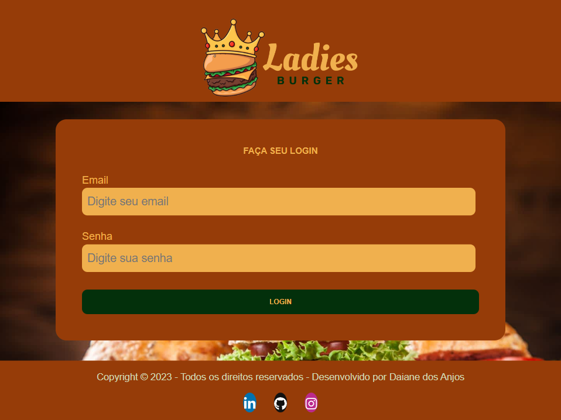

 

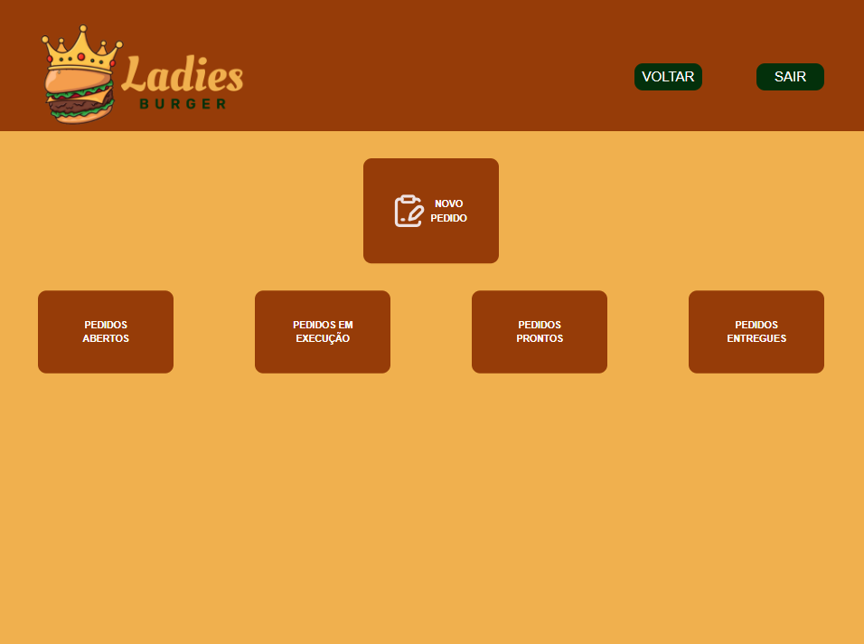

---
 

### História do usuário 2

O garçom deve ser capaz de anotar o pedido do cliente

**_"Como garçom, quero receber o pedido de um cliente para não depender da minha memória, para saber quanto cobrar e enviar para a cozinha para evitar erros e para que possam ser preparados na ordem."_**

#### Critérios de aceitação

Anotar o nome do cliente.  
Adicionar produtos ao pedido.  
Excluir produtos.  
Ver resumo e compra total.  
Enviar o pedido para a cozinha (salve em algum banco de dados).
Funcionar bem em um tablet.

 

 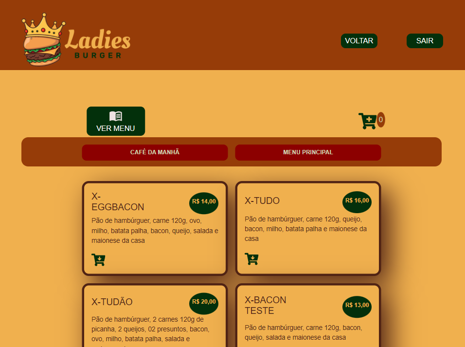

 

 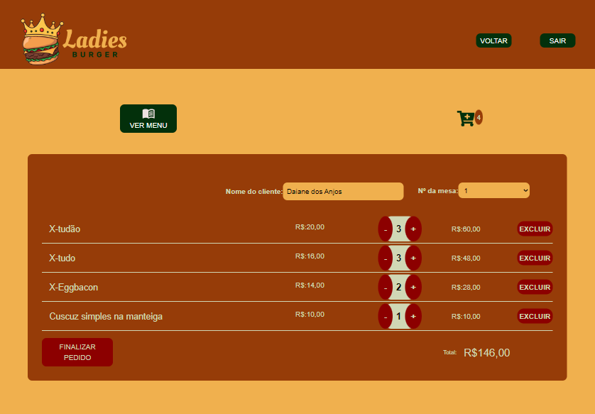

---
 

### História do usuário 3

O chef precisa ver os pedidos

**_"Como chefe de cozinha, quero ver os pedidos dos clientes em ordem e marcar quais estão prontos para saber o que precisa ser preparado e avisar aos atendentes que um pedido está pronto para ser servido a um cliente."_**

#### Critérios de aceitação

Visualizar os pedidos solicitados à medida que são feitos. 
Marcar os pedidos que foram preparados e estão prontos para serem servidos.  
Ver o tempo que levou para preparar o pedido desde a chegada até o momento em que foi marcado como concluído.
 

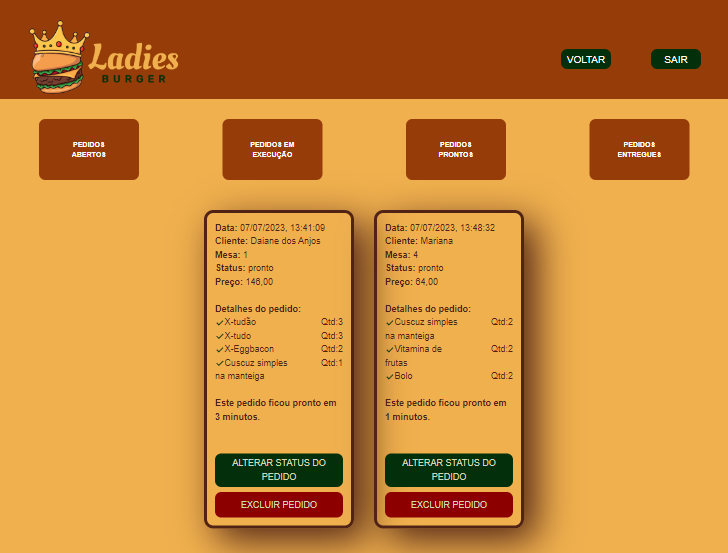

---
 

### História do usuário 4

Os garçons devem ver os pedidos que estão prontos para serem entregues.

**_"Como garçom, quero ver os pedidos que estão prontos para serem entregues rapidamente aos clientes que os fizeram."_**

#### Critérios de aceitação

Veja a lista de pedidos prontos para servir.

 

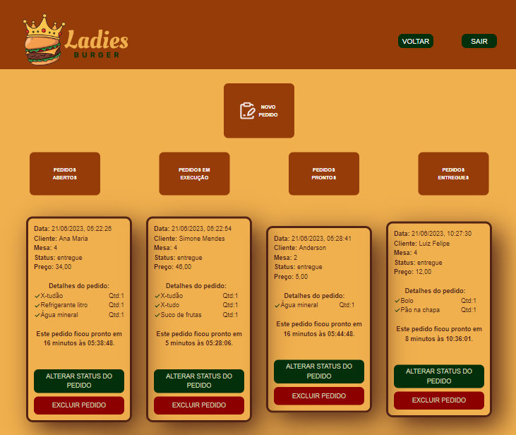

---
 

### História do usuário 5

O gerente da loja precisa gerenciar seus funcionários

**_"Como administrador de loja, quero gerenciar os usuários da plataforma para manter as informações de meus funcionários atualizadas."_**

#### Critérios de aceitação

Veja a lista de trabalhadores. 
Adicionar trabalhadores. 
Excluir trabalhadores. 
Atualize os dados do trabalhador.

 

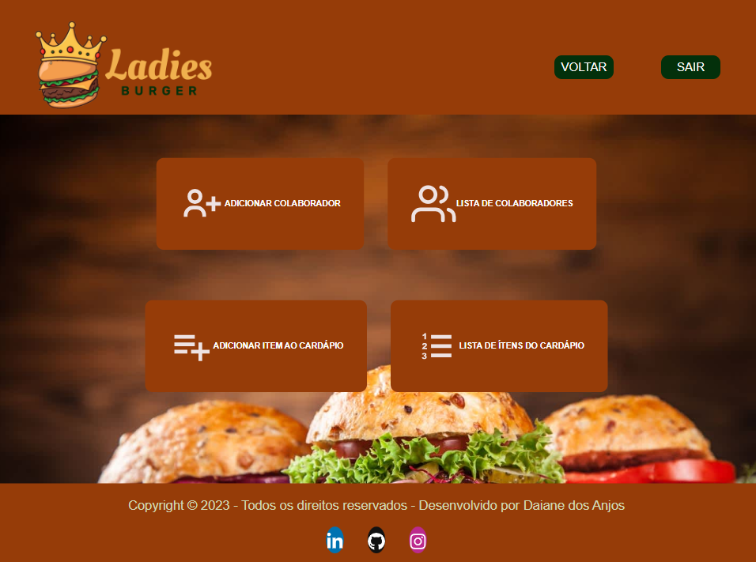

 

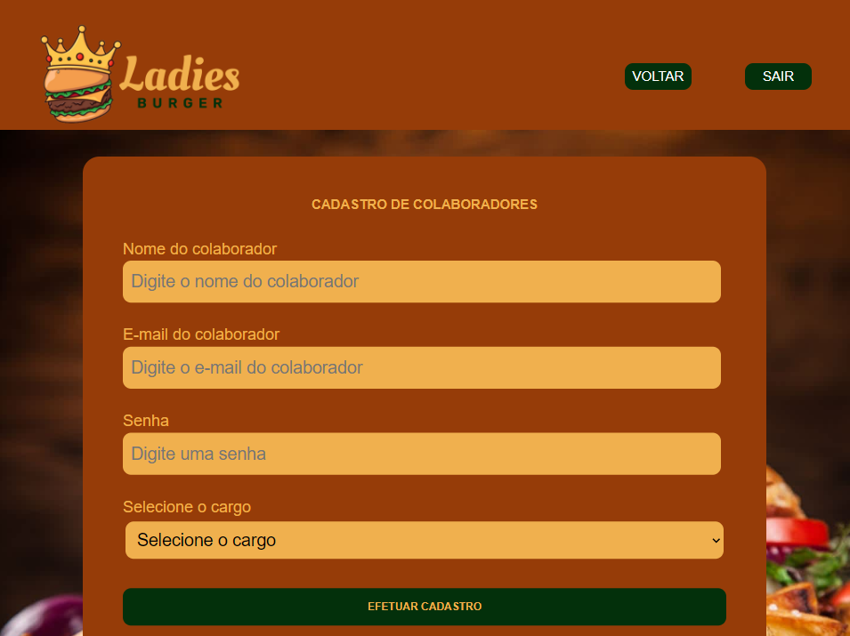

 

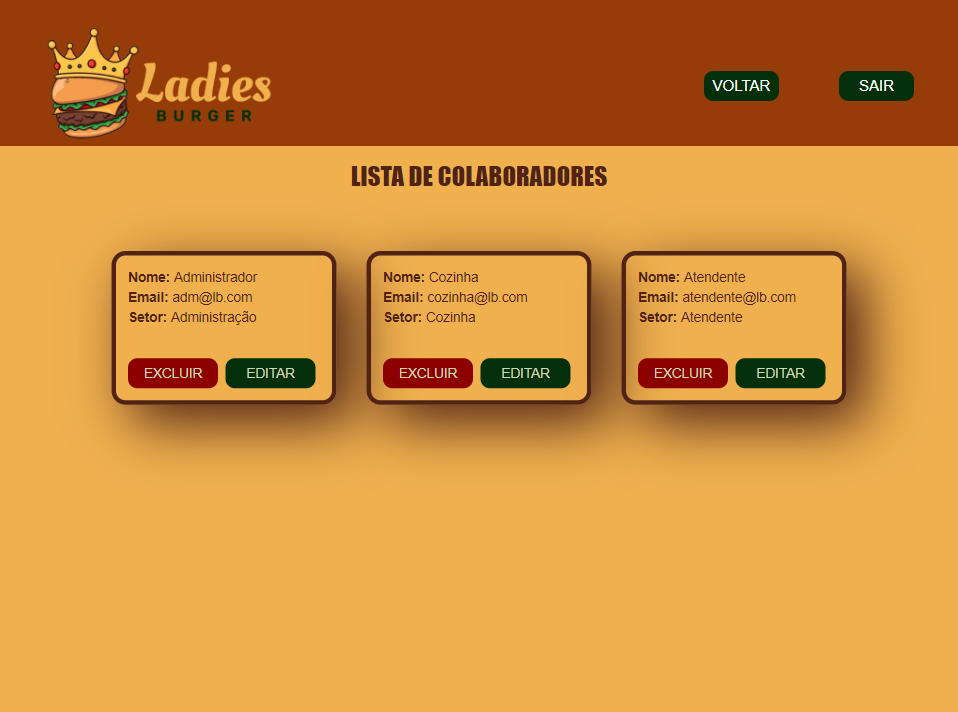

---
 

### História do usuário 6

O gerente da loja deve gerenciar seus produtos.

**_"Como administrador da loja deseja gerenciar os produtos para manter o cardápio atualizado."_**

#### Critérios de aceitação

Veja a lista de produtos.  
Adicione produtos.  
Excluir produtos. 
Atualize os dados do produto.

 

 

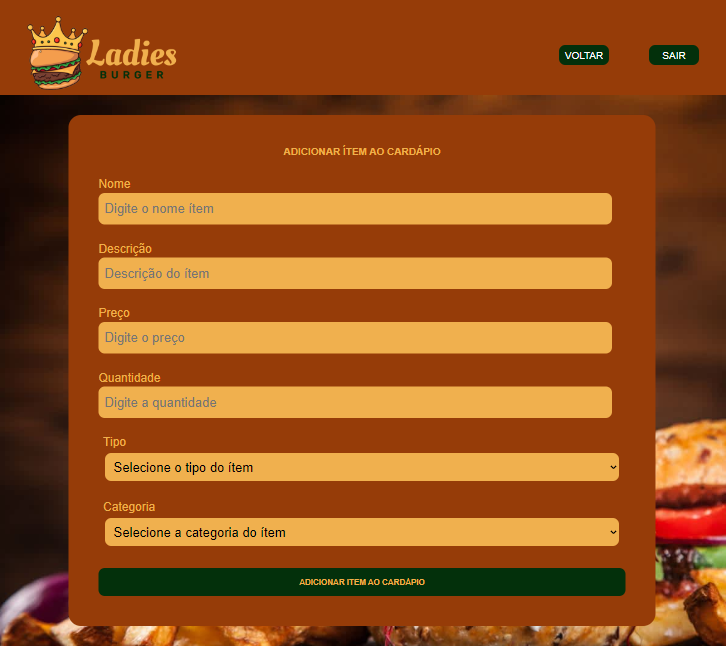

 

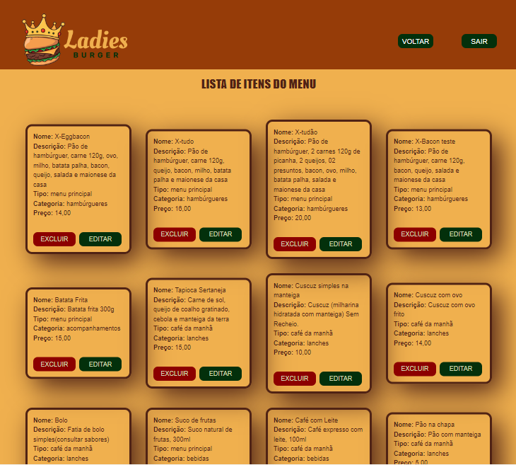

